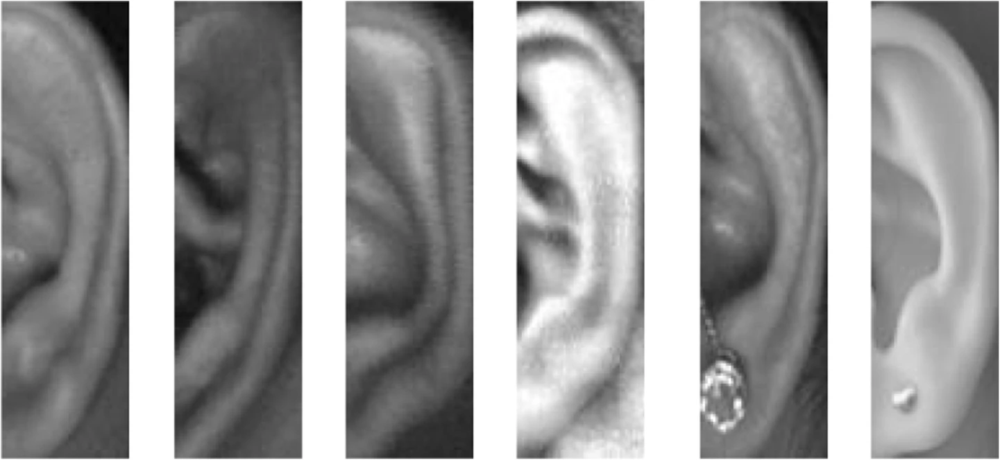

# Hybrid Deep Learning Model for Ear Detection and Landmark Extraction

## Abstract

Biometrics are physical or behavioral features used to digitally identify individuals and provide access to systems or data. Traditional face identification methods often fail when masks are worn, as seen during the COVID-19 pandemic. The human ear, which remains visible even with masks, offers a promising alternative for biometric recognition. This project introduces a hybrid deep learning (DL) model that leverages a modified VGG-16 architecture to detect and extract feature points from ear images. We preprocess ear images, train our model to identify landmark points, and use these features for accurate person identification.

**Keywords:** Unconstrained, Feature Points, Biometrics.

## I. Introduction

The human ear features a constant, unique structure from birth, making it a reliable biometric identifier. Unlike face recognition, ear biometrics is not affected by changes such as cosmetics or facial hair. This technology can provide valuable identification in scenarios where face recognition fails, such as in surveillance or identification systems. Ear biometrics offers a non-intrusive, stable method of personal identification, with growing demand for automated systems in various applications.

## A. Motivation

Ear biometrics face challenges with accuracy in unconstrained and non-aligned images. This project aims to improve ear image extraction and feature point identification using deep learning algorithms. By training a model on a diverse dataset, we enhance the accuracy of landmark detection for effective ear-based biometric identification.

## Methodology

### Proposed Work

The dataset is organized into `train` and `test` folders. Each folder includes:
- `images`: Contains unconstrained ear images.
- `landmarks`: Contains text files with landmark points corresponding to the images.

**Sample Dataset Images:**

**Data Processing:**
1. **Cropping and Transformation:**
   - Images are resized to 224x224 pixels.
   - Cropping is performed to isolate the ear part from the images.
   - Augmentation includes flipping, rotating, and resizing.

**Cropping Examples:**

2. **Training and Optimization:**
   - The training dataset contains 3000 images; the test dataset contains 630 images.
   - The Adam optimizer is used to minimize the mean squared error loss.
   - Mathematical formulation of the Adam optimizer:
     - The Adam optimizer updates weights and slopes using the following equations:
		1. **Update Weights:**
			$$\epsilon_{(\theta+1)} = \epsilon_\theta - \gamma_\theta \mu_\theta$$
		2. **Update Sum of Slopes:**
			$$\mu_\theta = \sigma \mu_{(\theta-1)} + (1 - \sigma) \frac{\delta L}{\delta \mu_\theta}$$

		where:
		 - $$\( \mu_\theta \)$$ represents the sum of slopes over time interval $$\theta$$.
		 - $$\( \mu_{(\theta-1)} \)$$ represents the sum of slopes over time interval $$\theta - 1$$.
		 - $$\( \epsilon_\theta \)$$ represents the weights at time interval $$\theta$$.
		 - $$\( \epsilon_{(\theta+1)} \)$$ represents the weights at time interval $$\theta + 1$$.
		 - $$\( \gamma_\theta \)$$ represents the learning rate at time interval $$\theta$$.
		 - $$\( \sigma \)$$ represents the moving average parameter.
		 - $$\( \delta L \)$$ represents the derivative of the loss function.
		 - $$\( \delta \mu_\theta \)$$ represents the derivative of weights at time $$\theta$$.

**Feature Points Extraction:**
- The model identifies and plots landmark points on ear images.

### Process Flow Diagram

**System Workflow:**
1. Input: Unconstrained ear image.
2. Output: Landmark points on the ear.

## Architecture

The hybrid DL model is a sequential model featuring:
- **Input Layer:** 224x224x3 image size.
- **Convolutional Layers:** 16 filters, various kernel sizes, rectified linear activation.
- **Max-Pooling:** Extracts useful features.
- **Batch Normalization:** Normalizes layer parameters to smooth learning.

**Model Architecture Diagram:**

## Results

The model successfully identifies and plots feature points on ear images, demonstrating improved accuracy over existing models.

**Extracted Feature Points:**

**Accuracy:**
- The model achieved an accuracy of 90.22%.
- Accuracy Graph: 
- Loss Graph: 

## Conclusions and Future Work

The proposed deep learning model effectively extracts and utilizes landmark points for ear biometric identification. The accuracy of feature extraction shows significant improvement compared to other models. Future work will focus on increasing model accuracy through enhanced training and exploring its potential for individual identification.

